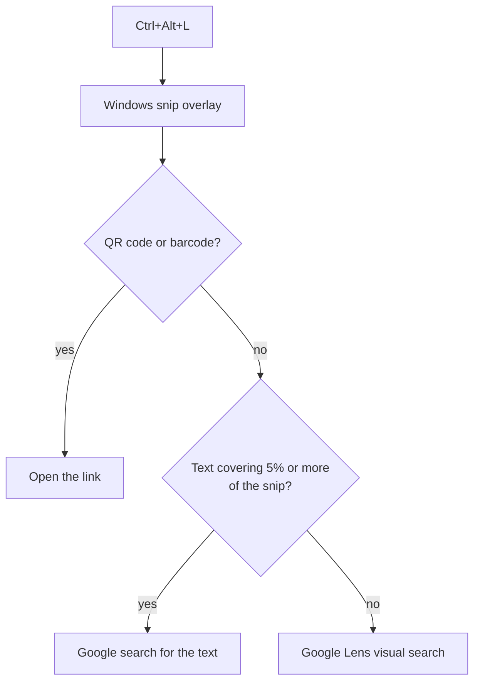

# SnipSearch

[](https://github.com/kevinpradith/snipsearch/actions/workflows/ci.yml)
[](LICENSE)
[](#requirements)
[](#requirements)

**Circle to Search for the Windows 11 machines Microsoft left out.**

Windows already has this feature. It is called Click to Do, and it needs a
Copilot+ PC with a 40+ TOPS NPU, which rules out most machines sold before 2024.
SnipSearch is the same gesture built out of parts Windows has shipped for years.

Press a hotkey, drag a box around anything on screen, and the snip goes where it
should:

| In the snip | What happens |
| --- | --- |
| QR code or barcode | its link opens |
| mostly text | Google search for that text, or the URL opens if it is one |
| anything else | Google Lens visual search |

## Why it is not just "screenshot, then upload"

Sending every snip to a reverse image search is the obvious version, and it is
wrong most of the time. Snip a paragraph and Google Lens answers *your image
didn't match any results*, because you did not want a lookalike image, you
wanted the words.

So SnipSearch looks at the snip first, locally, and only uploads when uploading
is actually the right answer.



That 5% is the whole trick. A screenshot of a sentence is roughly 20% text by
area; a photo with a caption in the corner is under 1%. Anything below the
threshold is treated as a picture that happens to have words on it, so a photo
of a camera does not turn into a search for the word printed on its body.

## Install

You need Windows 11. Everything the tool runs on already ships with it, so
there is nothing to build and no runtime to install first.

### 1. Get the files

Somewhere you intend to leave them. The hotkeys point at this folder by its
full path, so moving it later breaks them until you run the installer again.

With git:

```powershell
git clone https://github.com/kevinpradith/snipsearch.git
cd snipsearch
```

Without git: download the
[latest release](https://github.com/kevinpradith/snipsearch/releases/latest) as
a ZIP, extract it, and unblock the files, because Windows marks anything that
came from the internet and refuses to run it otherwise:

```powershell
cd path\to\snipsearch
Get-ChildItem -Recurse | Unblock-File
```

### 2. Run the installer

```powershell
powershell -NoProfile -ExecutionPolicy Bypass -File Install-SnipSearch.ps1
```

`-ExecutionPolicy Bypass` is there because Windows blocks unsigned scripts by
default. It applies to this one command only and changes nothing on the
machine.

It should print four lines:

```
CTRL+ALT+L  SnipSearch.lnk
CTRL+ALT+K  SnipSearch (image).lnk
CTRL+ALT+T  SnipSearch (text).lnk
ready       C:\Users\you\AppData\Local\SnipSearch\zxing.dll
```

The first three are the hotkeys. The fourth is the barcode library. A warning
instead of that last line means only barcode reading is unavailable; the rest
works.

### 3. Use it

Press `Ctrl+Alt+L`. The Windows snip overlay dims the screen; drag a box around
whatever you want to look up, and a browser tab opens with the answer.

| Key | Mode |
| --- | --- |
| `Ctrl+Alt+L` | route by content |
| `Ctrl+Alt+K` | force Google Lens, for a picture that has text on it |
| `Ctrl+Alt+T` | force the text lookup, and copy the text to the clipboard |

If nothing happens, see [the hotkey does nothing](#the-hotkey-does-nothing).

Windows reserves the `Ctrl+Alt` prefix for shortcut hotkeys, so only the final
key can be changed, in each shortcut's properties or in the table at the top of
`Install-SnipSearch.ps1`.

### Updating and removing

```powershell
git pull
powershell -NoProfile -ExecutionPolicy Bypass -File Install-SnipSearch.ps1
```

Re-running the installer is always safe; it overwrites the shortcuts in place.
Run it after moving the folder, too.

To remove the hotkeys:

```powershell
powershell -NoProfile -ExecutionPolicy Bypass -File Install-SnipSearch.ps1 -Uninstall
```

That leaves the folder and the downloaded library alone. Delete the folder and
`%LOCALAPPDATA%\SnipSearch` to remove every trace.

### Triggering it from the touchpad

Settings → Bluetooth & devices → Touchpad → Advanced gestures → Three-finger
gestures → Taps → Custom shortcut, then record `Ctrl+Alt+L`. Windows exposes
taps only; there is no press-and-hold gesture to bind, which is the one part of
the phone gesture that cannot be reproduced.

## Requirements

Windows 11, and nothing you have to install. It runs on the Windows PowerShell
5.1 that ships with Windows, not PowerShell 7, because text recognition goes
through WinRT, which only .NET Framework can load. The shortcuts call the right
one for you.

| Job | What does it |
| --- | --- |
| Capture | the Windows snip overlay (`ms-screenclip:`) |
| Text recognition | `Windows.Media.Ocr`, on device |
| Upload | the `curl.exe` that ships with Windows |
| Running without a console flash | `wscript.exe` |

The single gap is barcodes, for which Windows has no API at all. The installer
fetches [ZXing.NET](https://github.com/micjahn/ZXing.Net) from NuGet, verifies it
against a SHA-256 pinned in `src/Install-BarcodeReader.ps1`, and stores it under
`%LOCALAPPDATA%\SnipSearch`. If that download fails, barcode reading is skipped
and everything else still works.

## Privacy

Barcode decoding and text recognition happen on the machine. The snip leaves it
only on the Lens path, which uploads the image to Google, and on the text path,
which sends the recognized text as an ordinary search query. See
[SECURITY.md](SECURITY.md) for the full list of what it touches.

## Troubleshooting

### The hotkey does nothing

Windows registers shortcut hotkeys when Explorer starts, and a shortcut that
replaced an older one can be left unregistered. Restart Explorer:

```powershell
Stop-Process -Name explorer -Force
```

If it still does nothing, another program may already own `Ctrl+Alt+L`. Change
the key in the shortcut's properties, under Start menu → All apps → SnipSearch,
right click → More → Open file location, then right click the shortcut →
Properties → Shortcut key.

### It stopped working after I moved the folder

The shortcuts hold the full path to the launcher. Run `Install-SnipSearch.ps1`
again from the new location.

### "running scripts is disabled on this system"

You ran the script without `-ExecutionPolicy Bypass`. Use the full command in
[Install](#2-run-the-installer). If you downloaded a ZIP rather than cloning,
run `Get-ChildItem -Recurse | Unblock-File` in the folder first.

### A photo keeps turning into a text search, or the other way around

Move the threshold and see which way it needs to go:

```powershell
.\src\Invoke-SnipSearch.ps1 -Image .\sample.png -TextCoverage 0.10 -Verbose
```

### Barcodes are never detected

Re-run the installer; it reports the assembly path when the download succeeded.
`-Verbose` on the script says when the step was skipped.

## Layout

```
Install-SnipSearch.ps1         registers or removes the hotkeys
src/Invoke-SnipSearch.ps1      capture and routing
src/Install-BarcodeReader.ps1  fetches and verifies ZXing.NET
src/SnipSearch.vbs             runs the script without a console window
```

## Development

Route a file instead of the screen, which is much faster than taking a
screenshot for every change:

```powershell
.\src\Invoke-SnipSearch.ps1 -Image .\sample.png -Mode auto -Verbose
```

Lint before committing, which is what CI does:

```powershell
Invoke-ScriptAnalyzer -Path . -Recurse
```

See [CONTRIBUTING.md](CONTRIBUTING.md) for the rest, and [CHANGELOG.md](CHANGELOG.md)
for what has changed.

## License

[MIT](LICENSE) © Kevin Praditiansyah
